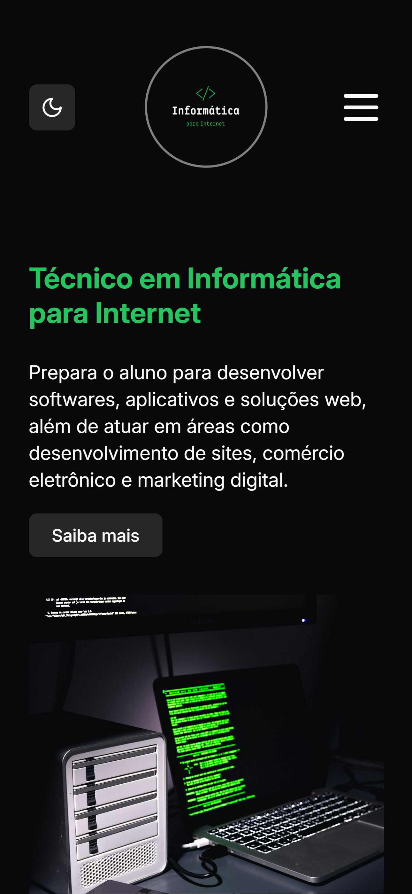
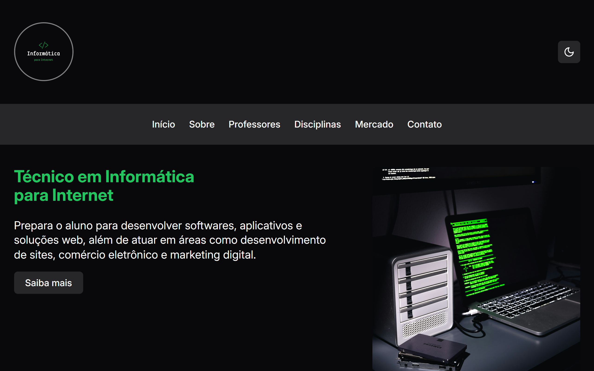

<p align="center">
  

  

  <a href="https://github.com/pedroeuzebiodev/portfolio-tii-ifce/commits/master">
    
  </a>

   

   <a href="https://github.com/pedroeuzebiodev/portfolio-tii-ifce/stargazers">
    
  </a>

  <a href="https://pedroeuzebiodev.github.io/portfolio-tii-ifce">
    
  </a>
</p>

<h1 align="center">
  
</h1>

<h4 align="center">
 🚧  Técnico em Informática para Internet | Portfólio | IFCE Campus Baturité 🌐 em construção... 🚧
</h4>

<p align="center">
 <a href="#-sobre-o-projeto">Sobre</a> •
 <a href="#-funcionalidades">Funcionalidades</a> •
 <a href="#-layout">Layout</a> • 
 <a href="#-como-executar-o-projeto">Como executar</a> • 
 <a href="#-tecnologias">Tecnologias</a> • 
 <a href="#-contribuidores">Contribuidores</a> • 
 <a href="#-autor">Autor</a> • 
 <a href="#user-content--licença">Licença</a>
</p>

## 💻 Sobre o projeto

🌐 Técnico em Informática para Internet | Portfólio | IFCE Campus Baturité - é um website para apresentar informações do curso de Técnico em Informática para Internet do IFCE Campus Baturité responsivo e com troca de tema.

---

## ⚙️ Funcionalidades

- [x] Usuários podem trocar o tema do website clicando no botão do lado superior a direita:

  - [x] Tema escuro (padrão)
  - [x] Tema claro

---

## 🎨 Layout

O layout da aplicação está disponível no Figma:

<a href="https://www.figma.com/design/xwKuFEyzOxiLlq26qTcPXC/Inform%C3%A1tica-para-Internet-%7C-Portf%C3%B3lio-%7C-IFCE-Campus-Baturit%C3%A9?node-id=0-1&t=3VB7NJccf0yE7fmw-1">
  
</a>

### Mobile

<p align="center">
  
</p>

### Web

<p align="center">
  
</p>

---

## 🚀 Como executar o projeto

### Pré-requisitos

Antes de começar, você vai precisar ter instalado em sua máquina as seguintes ferramentas: [Git](https://git-scm.com), [Node.js](https://nodejs.org/en/). Além disto é bom ter um editor para trabalhar com o código como [VSCode](https://code.visualstudio.com/)

#### 🧭 Rodando o projeto

```bash

# Clone este repositório
$ git clone git@github.com:pedroeuzebiodev/portfolio-tii-ifce.git

# Acesse a pasta do projeto no seu terminal/cmd
$ cd portfolio-tii-ifce

# Instale as dependências
$ npm install

# Execute a aplicação em modo de desenvolvimento
$ npm run dev

# A aplicação será aberta na porta:5173 - acesse http://localhost:5173

```

---

## 🛠 Tecnologias

As seguintes ferramentas foram usadas na construção do projeto:

#### **Website**

- **[React](https://react.dev)**
- **[Vite.js](https://vite.dev)**
- **[Tailwind CSS](https://tailwindcss.com)**

#### **Utilitários**

- Protótipo: **[Figma](https://www.figma.com/)** → **[Protótipo (Técnico em Informática para Internet)](https://www.figma.com/design/xwKuFEyzOxiLlq26qTcPXC/Inform%C3%A1tica-para-Internet-%7C-Portf%C3%B3lio-%7C-IFCE-Campus-Baturit%C3%A9?node-id=0-1&t=3VB7NJccf0yE7fmw-1)**
- Editor: **[Visual Studio Code](https://code.visualstudio.com/)** → Extensions: **[Live Server](https://marketplace.visualstudio.com/items?itemName=ritwickdey.LiveServer)**
- Markdown: **[StackEdit](https://stackedit.io/)**, **[Markdown Emoji](https://gist.github.com/rxaviers/7360908)**
- Commit Conventional: **[Commitlint](https://github.com/conventional-changelog/commitlint)**
- Ícones: **[Lucide React](https://lucide.dev)**
- Fontes: **[Inter](https://fonts.google.com/specimen/Inter)**

---

## 👨‍💻 Contribuidores

💜 Um super thanks 👏 para essa galera que fez esse projeto sair do campo da ideia e entrar na web :)

<table>
  <tr>
    <td align="center">
      <a href="https://github.com/Abilio-Monteiro">
        
        <br />
        <sub>
          <b>Abílio Monteiro</b>
        </sub>
      </a>
    </td>
    <td align="center">
      <a href="https://github.com/ataslanmonteiro">
        
        <br />
        <sub>
          <b>Ataslan Monteiro</b>
        </sub>
      </a>
    </td>
    <td align="center">
      <a href="https://github.com/Micaelxp">
        
        <br />
        <sub>
          <b>Micael Nascimento</b>
        </sub>
      </a>
    </td>
    <td align="center">
      <a href="https://github.com/NicolasFirmino10">
        
        <br />
        <sub>
          <b>Nicolas Firmino</b>
        </sub>
      </a>
    </td>
    <td align="center">
      <a href="https://github.com/pedroeuzebiodev">
        
        <br />
        <sub>
          <b>Pedro Euzebio</b>
        </sub>
      </a>
    </td>
  </tr>
</table>

## 💪 Como contribuir para o projeto

1. Faça um **fork** do projeto.
2. Crie uma nova branch com as suas alterações: `git checkout -b my-feature`
3. Salve as alterações e crie uma mensagem de commit contando o que você fez: `git commit -m "feature: My new feature"`
4. Envie as suas alterações: `git push origin my-feature`

---

## 🦸 Autor

<a href="https://www.linkedin.com/in/pedroeuzebio">
  

  <br />

  <sub>
    <b>Pedro Euzebio</b>
  </sub>
</a>

<br>

<a href="mailto:pedroeuzebio.contato@gmail.com" class="contato">
  
</a>

<a href="https://www.linkedin.com/in/pedroeuzebio" class="contato">
  
</a>

---

## 📝 Licença

Este projeto esta sobe a licença [MIT](./LICENSE).

Feito com ❤️ por Pedro Euzebio 👋 [Entre em contato!](https://www.linkedin.com/in/pedroeuzebio)
